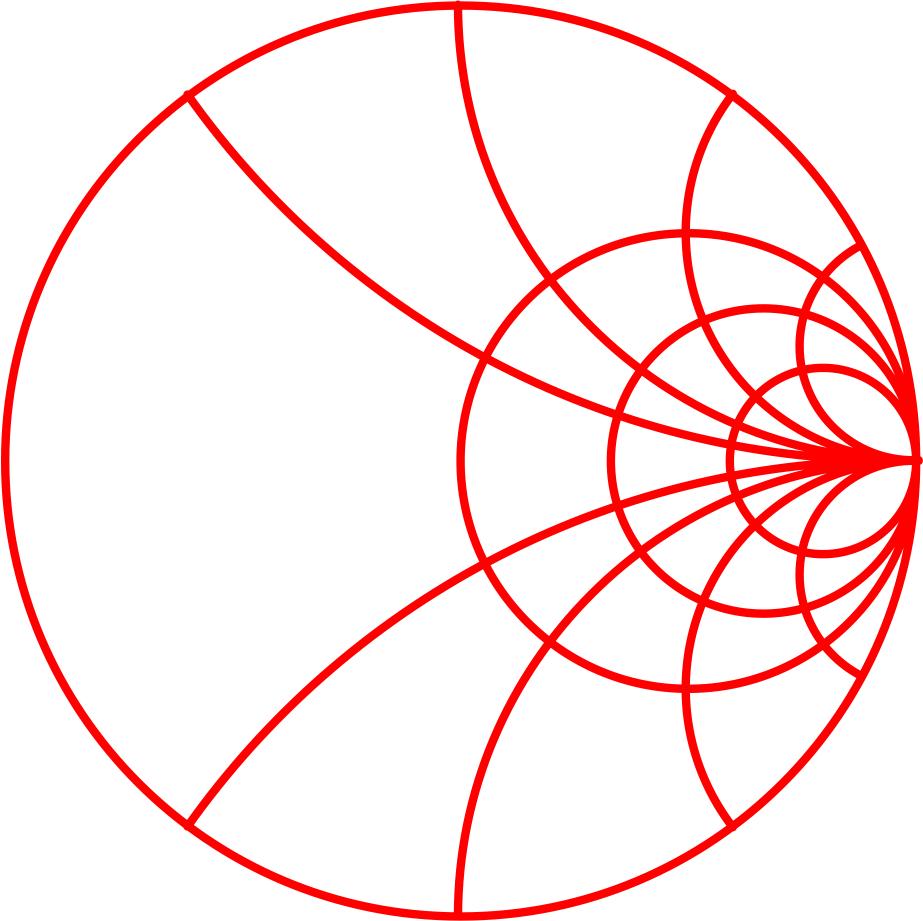
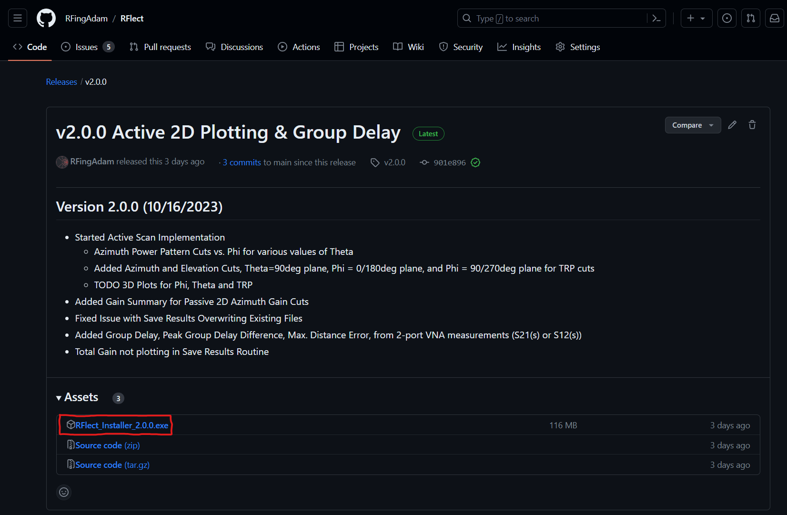
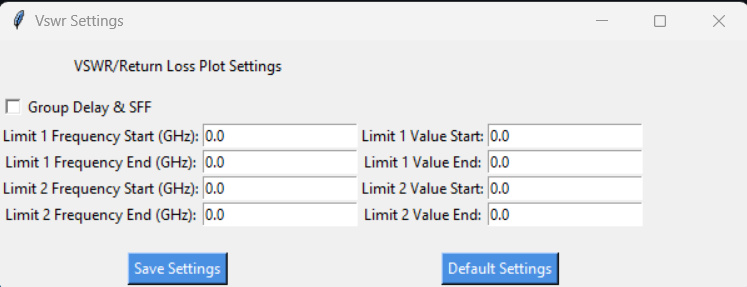
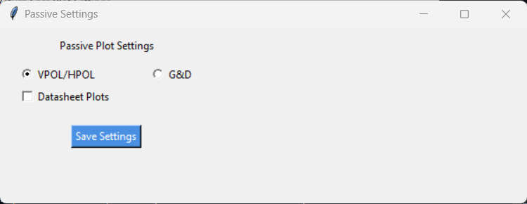

# RFlect - Antenna Plot Tool      

**Version:** 2.1.0

RFlect is a comprehensive antenna plotting tool, currently designed specifically for visualizing and analyzing antenna measurements from the Howland Company 3100 Antenna Chamber and WTL Test Lab outputs. Additionally, it offers support for .csv VNA files from Copper Mountain RVNA and S2VNA software of S11/VSWR/Group Delay(S21(s)) measurements, making it a versatile choice for a wide range of antenna data processing needs. Through its user-friendly graphical interface, RFlect provides an intuitive way to handle various antenna metrics and visualize results.

## Installation
1. Run the provided installer from the latest release (`RFlect_vX.X.X.exe`)
2. Follow the on-screen instructions to complete the installation.

## How to Use
### Select Scan Type:
- Choose from **Active**, **Passive**, or **.csv (VNA/S-Parameters)** scan.

  

### Adjust Settings (if needed):
- Click the **Settings** button to open the settings window.
- Depending on your scan type selection, adjust the relevant settings.
  - For VNA/S11 LogMAG scans, you can set limit lines.
  - Select Group Delay & SFF(*future implementation*) for Group Delay Measurements, Peak to Peak Delay Difference, etc from 2-Port S2VNA .csv files
    
  - For Passive scans, select between G&D or HPOL/VPOL.
  - Datasheet Plots Check Option will additionally plot Peak Phi & Theta Gain vs Frequency with Total Gain vs Freq. Also plots Elevation/Azimuth 2D cuts for 3-planes.
    
  - For Active scans, *future implementation*

### Import Data:
- Click the **Import File(s)** button.
- Follow the on-screen prompts to select and import your data files.

### View Results:
- If you've selected a VPOL/HPOL Passive scan, or Active Scan, you can click **View Results** to visualize the data.
- For other scan types, results will be displayed after data import.

<strong>**Example Results (click to expand)**</strong>

Here are some examples of the results you can expect with this tool. Click on an image to view it in full size.

# Passive Routine
## G&D Files
### Passive G&D Comparison

Efficiency, Gain, and Directivity comparison of 'n' Number of G&D Files/Scans

## HPOL & VPOL Files
### Passive 1D Results

Eff(%) vs Freq., Eff(dB) vs Freq., and Total Gain vs Freq.

### Passive 2D Results

Gain Pattern Azimuth Cuts vs Phi for various Theta Angles

### Additional Passive "Datasheet" Plots

Peak gain for Phi & Theta Polarization in addition to Total Gain per IEEE Definition and Additional Polar plots for Azimuth, Theta=90deg, Elevation Phi=0deg&180deg, and Elevation Phi=90deg&270deg

### Passive 3D Results

3D Gain Pattern for Phi, Theta, and Total Gains

# Active Routine
## TRP Files
### Active 2D Results

Azimuth Power Cuts vs Phi for various Theta Angles

Additional Polar plots for Azimuth, Theta=90deg, Elevation Phi=0deg&180deg, and Elevation Phi=90deg&270deg

# VNA Routine
## Text/.csv Files
### 1 or 2-Port S-Parameters

'n' number of S-Parameter Files Plotted

## 2-Port, Group Delay Measurements

Plots Group Delay vs Frequency for Various Theta (Azimuthal Rotation), Peak-to-peak Group Delay Difference over Theta, and Max Distance Error over Theta

## Additional Features
- Save your results using the **Save Results to File** button.
- Adjust the frequency and other parameters using the provided dropdown menus and input fields.

## Note to Users
- Always ensure the data you're importing is consistent with the scan type you've selected.
- For best results, ensure that settings are appropriately adjusted before importing data.

---

**The software is under active development, and additional features and improvements are expected in the future. Please refer to the release notes for version-specific details.**