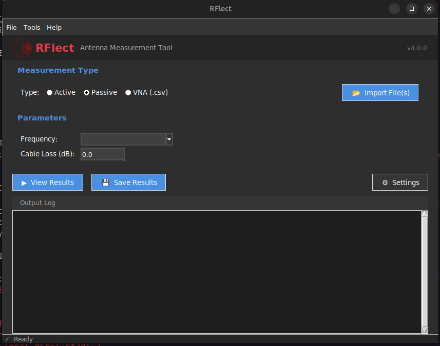
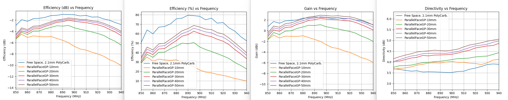
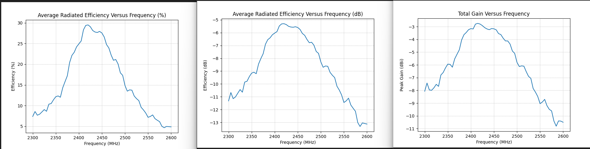
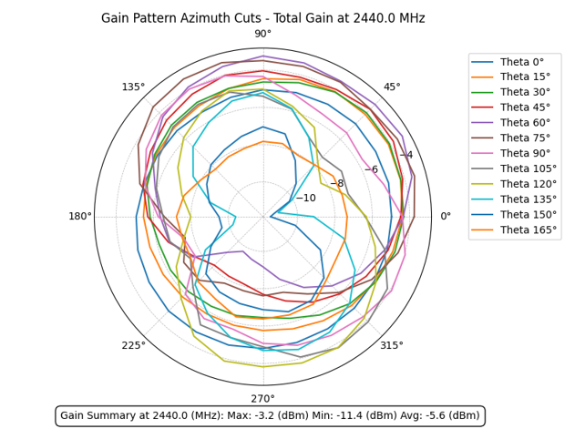
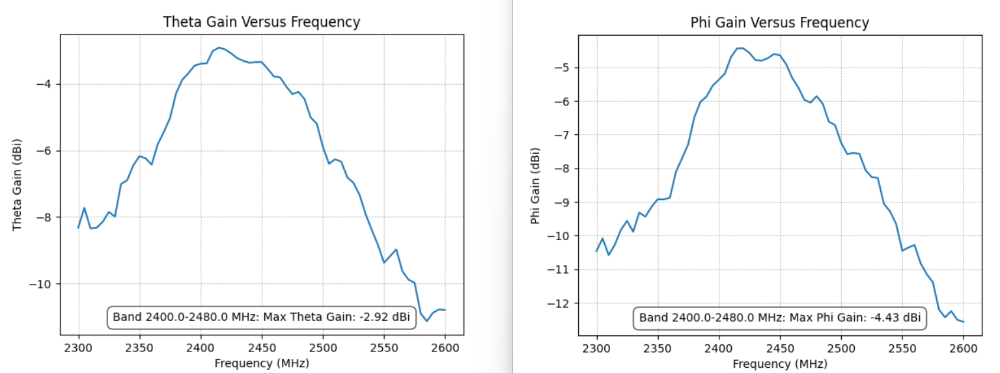
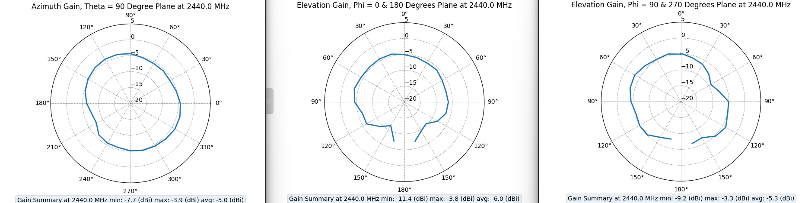
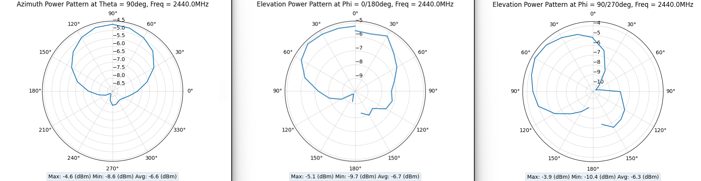
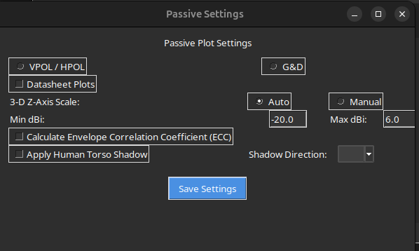

<p align="center">
  
</p>

<h1 align="center">RFlect</h1>

<p align="center">
  <strong>Antenna measurement visualization and analysis for RF engineers.</strong>
</p>

<p align="center">
  <a href="https://github.com/RFingAdam/RFlect/releases"></a>
  
  <a href="LICENSE"></a>
  <a href="https://rfingadam.github.io/RFlect/"></a>
</p>

<p align="center">
  <a href="https://rfingadam.github.io/RFlect/">Documentation</a> &middot;
  <a href="https://rfingadam.github.io/RFlect/getting-started/quickstart/">Quickstart</a> &middot;
  <a href="https://rfingadam.github.io/RFlect/mcp/overview/">MCP</a>
</p>

---

RFlect turns antenna-chamber and VNA files into 2D/3D radiation-pattern plots, TRP and gain metrics, polarization analysis, UWB characterization, and DOCX reports. Use the desktop GUI for interactive review, or drive the same math over MCP from Claude Code, Cline, or any stdio MCP client.

It is analysis software, not a certified test laboratory. TRP uses the CTIA / IEEE-149 discrete solid-angle form; that is a calculation convention, not lab accreditation or product certification.

<p align="center">
  
</p>

## Entrypoints

| How you work | Command |
|--------------|---------|
| **GUI** | `python run_rflect.py` (or `rflect` after `pip install -e .`) |
| **MCP server** | `python rflect-mcp/server.py` (stdio; usually launched by your MCP client) |
| **Tests** | `python -m pytest tests/` |

There is no separate analysis CLI. Batch work goes through the GUI Tools menu or MCP (`process_folder`, `bulk_process_passive`, `bulk_process_active`). See [CLI reference](https://rfingadam.github.io/RFlect/reference/cli/).

## Install

**Windows:** `RFlect_Installer_vX.X.X.exe` or portable `RFlect_vX.X.X.exe` from [Releases](https://github.com/RFingAdam/RFlect/releases).

**Linux:** `RFlect_vX.X.X_linux` from the same page; `chmod +x` and run. Pre-built macOS binaries are not published; build from source.

**From source** (Python 3.11+; Tk/tkinter required for the GUI):

```bash
git clone https://github.com/RFingAdam/RFlect.git
cd RFlect
python -m venv .venv && source .venv/bin/activate  # Windows: .venv\Scripts\activate
pip install -r requirements.txt
python run_rflect.py
```

Optional extras from `pyproject.toml`:

```bash
pip install -e ".[mcp]"          # MCP server (mcp SDK)
pip install -e ".[instruments]"  # live VNA/positioner (pyvisa, pyserial)
pip install -r requirements-dev.txt
```

MCP also needs PyYAML (`pip install -r rflect-mcp/requirements.txt` if you are not using the `mcp` extra). Details: [MCP installation](https://rfingadam.github.io/RFlect/mcp/installation/).

## Example data and plot outputs

This public repo does **not** ship customer chamber captures.

| What | Where | What it is |
|------|--------|------------|
| GUI / plot screenshots | [`assets/`](assets/) | Representative outputs (scan selector, 1D/2D/3D patterns, VNA, group delay). Not a measurement dataset. |
| Synthetic cal-drift fixtures | [`tests/fixtures/cal_drift/`](tests/fixtures/cal_drift/) | Small hand-written TRP-cal files for tests. |
| Optional local measurements | `RFLECT_TEST_DATA_DIR` | Point integration tests at *your* WTL/VNA files. Skipped in CI if unset. |

Most unit tests use in-memory synthetic grids (`tests/conftest.py`). Golden-reference tests lock TRP math against analytic oracles (isotropic EIRP integrates back to itself), not against a certified lab report.

<details>
<summary><strong>Example plot outputs (click to expand)</strong></summary>

### Passive

**G&amp;D comparison** — efficiency, gain, and directivity across scans:


**HPOL/VPOL 1D** — efficiency and total gain vs frequency:


**2D azimuth cuts**:


**Datasheet-style plots**:



**3D radiation pattern** (turbo colormap):


### Active TRP




### VNA / S-parameters and group delay


</details>

## What it handles

| Scan type | Input | Output |
|-----------|--------|--------|
| **Active TRP** | WTL `.txt` (V5.02 / V5.03) | TRP, H/V power, 2D/3D patterns |
| **Passive gain** | WTL HPOL + VPOL `.txt` pairs | Total/H/V gain, efficiency, directivity |
| **S-parameters** | Copper Mountain / generic VNA `.csv`, Touchstone `.s2p` | S11, VSWR, return loss, impedance bandwidth |
| **Group delay** | 2-port VNA `.csv`, `.s2p` | Group delay vs frequency, peak-to-peak, distance error |
| **UWB** | S2VNA `.csv`, `.s2p` | SFF, transfer function, impulse response |
| **CST far-field** | CST `.txt` exports | ECC, fidelity factor, group delay |
| **Folder of the above** | Directory | One-call MCP `process_folder` (passive / active / cal-drift / UWB) |

Formats: [file-formats](https://rfingadam.github.io/RFlect/hardware/file-formats/). Measurement matrix: [measurement types](https://rfingadam.github.io/RFlect/reference/measurement-types/).

## GUI usage

1. **Select scan type**: Active, Passive, or VNA (VSWR / S-parameters).
2. **Adjust settings**: cable loss, limit lines, frequency range, 3D scale.
3. **Import files** (`Ctrl+O` or Import). For passive, pick the HPOL file; RFlect matches VPOL by filename suffix.
4. **View results**: plots render automatically; `Ctrl+R` / `F5` reprocess.

<p align="center">
  
</p>

Also in the GUI: polarization (AR / tilt / XPD / LHCP-RHCP), batch folder processing, maritime/horizon plots, advanced RF dialogs (link budget, indoor, fading, MIMO, wearable), cal-drift, and DOCX export.

## MCP (61 tools)

RFlect makes **no outbound LLM calls** and needs no API key. The MCP agent *is* the LLM: it calls RFlect for numbers and plots, and may pass narrative into `generate_report`.

```json
{
  "mcpServers": {
    "rflect": {
      "command": "/absolute/path/to/RFlect/.venv/bin/python",
      "args": ["/absolute/path/to/RFlect/rflect-mcp/server.py"]
    }
  }
}
```

On Windows use `.venv/Scripts/python.exe` and forward slashes. Then, for example:

```
Process every passive pair in /path/to/wifi_antenna and generate a report.
```

| Area | Examples |
|------|----------|
| Import & bulk | `import_passive_pair`, `import_active_processed`, `process_folder` |
| Pattern analysis | `analyze_pattern`, `get_gain_statistics`, `compare_polarizations` |
| Reports | `generate_report`, `preview_report` |
| UWB | `analyze_uwb_channel`, `calculate_sff_from_files` |
| Cal drift | `cal_drift_ingest`, `cal_drift_compare` |
| RF methods | `synthesize_array`, `near_field_to_far_field`, `calculate_tis` |
| VNA / S-params | `analyze_s11`, `analyze_group_delay` |
| Link / MIMO | `estimate_link_budget`, `analyze_mimo_diversity` |
| Compliance | `check_spec_compliance`, `compute_uncertainty_budget` |
| Instruments | `vna_read_trace`, `positioner_scan_grid` (in-memory mock unless hardware extras are installed) |

Full inventory: [MCP_STATUS.md](MCP_STATUS.md) and [tools reference](https://rfingadam.github.io/RFlect/mcp/tools-reference/). Setup: [rflect-mcp/README.md](rflect-mcp/README.md).

## Current release (v6.1.0)

v6.1.0 is a 3D-rendering and Windows-packaging fix on top of the v6.0 analysis/MCP expansion (61 tools). Highlights of the current tree:

- Desktop GUI (dark ttk theme) plus MCP for headless/agent workflows
- 3D patterns with equal aspect ratio and a DUT orientation triad
- Maritime/horizon plots, cal-drift tracking, UWB SFF
- Optional SCPI VNA / positioner tools (mock without hardware)

Full notes: [CHANGELOG.md](CHANGELOG.md), [RELEASE_NOTES.md](RELEASE_NOTES.md).

## Project structure

```
RFlect/
  plot_antenna/              # Core library + GUI
    gui/                     # Tk window, dialogs, tools, callbacks
    analysis_engine.py       # Gain stats, pattern, polarization
    calculations.py          # TRP, passive gain, efficiency
    rf_methods.py            # Array factor, NF2FF, TIS, time-gating, …
    file_utils.py            # WTL / VNA / Touchstone parsers
    plotting.py              # 2D/3D matplotlib
    uwb_analysis.py          # SFF, transfer function, impulse response
    cal_drift.py             # Calibration-history tracker
    save.py                  # DOCX reports
  rflect-mcp/                # MCP server (61 tools)
  tests/                     # pytest (synthetic fixtures; optional local real files)
  assets/                    # Logo + example plot screenshots
  run_rflect.py              # GUI launcher
```

## Development

```bash
pip install -r requirements-dev.txt
python -m pytest tests/
pyinstaller RFlect.spec
```

See [CONTRIBUTING.md](CONTRIBUTING.md).

## License

[AGPL-3.0-or-later](LICENSE). There is no standing commercial-license offer.

The project name and logo files are **not** part of the licensed work. The licence grants no permission to use them except as needed to describe the origin of the work.

Vendor names (WTL, Copper Mountain, CST, CTIA, and similar) identify file formats and methods RFlect talks to. That is nominative use, not affiliation or endorsement.
