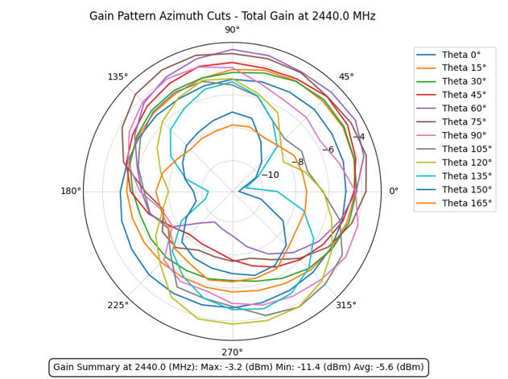

<p align="center">
  
</p>

<h1 align="center">RFlect</h1>

<p align="center">
  <strong>The RF engineer's toolkit for antenna measurement visualization and analysis.</strong>
</p>

<p align="center">
  <a href="https://github.com/RFingAdam/RFlect/releases"></a>
  
  <a href="LICENSE"></a>
  
</p>

---

RFlect takes raw antenna measurement data and turns it into publication-ready 2D/3D radiation pattern plots, TRP calculations, polarization analysis, and efficiency metrics — all validated against IEEE-standard methods. Whether you're characterizing a BLE chip antenna or qualifying a cellular array, RFlect handles the heavy lifting so you can focus on the engineering.

<p align="center">
  
</p>

## New in v4.1

- **Maritime/horizon antenna plots** — 5 new plot types for on-water antenna analysis: Mercator heatmap, conical cuts, gain-over-azimuth, horizon statistics table, and 3D pattern with horizon band highlighting. Configurable via settings toggle.
- **Windows installer overhaul** — Proper app icon on shortcuts, no console window, seamless in-place upgrades, release notes shown after install, and old-version cleanup.
- **Startup crash fix** — Update checker no longer crashes when network is unavailable or GUI isn't fully initialized.
- **391 tests** — Up from 346 in v4.0, with 45 new maritime plot tests.

## New in v4.0

Ground-up overhaul from v3.x — new GUI, new analysis engine, new integrations, and corrected RF math throughout.

- **11 RF engineering fixes** — Corrected diversity gain (Vaughan-Andersen), axial ratio, XPD, TRP integration, HPBW boundary wrapping, and more. Every formula verified against IEEE references and real chamber data.
- **UWB analysis** — System Fidelity Factor via cross-correlation, phase reconstruction from group delay, Touchstone .s2p support, transfer function extraction, and impulse response characterization.
- **Modern dark GUI** — Complete visual redesign with dark ttk theme, color-coded log output, keyboard shortcuts (`Ctrl+R`/`F5`), and WCAG AA contrast compliance.
- **Multi-provider AI** — Unified LLM abstraction supporting OpenAI, Anthropic, and Ollama. AI chat assistant with function-calling tools, report generation, and vision-based plot analysis.
- **Secure API key storage** — Fernet AES-128 encryption with PBKDF2 (600K iterations), machine-ID binding, and OS keyring integration.
- **MCP server with 23 tools** — Programmatic antenna analysis for Claude Code and other AI assistants, including UWB characterization.
- **346 tests** — Up from ~50 in v3.x, with integration tests against real BLE/LoRa chamber measurements and UWB group delay data.

See [RELEASE_NOTES.md](RELEASE_NOTES.md) for the full changelog.

## Quick Start

**Windows:** Grab `RFlect_Installer_vX.X.X.exe` or the standalone `RFlect_vX.X.X.exe` from the [latest release](https://github.com/RFingAdam/RFlect/releases).

**Linux:** Download `RFlect_vX.X.X_linux` from the [latest release](https://github.com/RFingAdam/RFlect/releases), then `chmod +x` and run.

**From source:**
```bash
git clone https://github.com/RFingAdam/RFlect.git
cd RFlect
python -m venv .venv && source .venv/bin/activate  # or .venv\Scripts\activate on Windows
pip install -r requirements.txt
python run_rflect.py
```

## What It Handles

| Scan Type | Input Format | What You Get |
|-----------|-------------|----------|
| **Active TRP** | WTL `.txt` (V5.02/V5.03) | TRP, H/V power, 2D/3D radiation patterns |
| **Passive Gain** | WTL HPOL + VPOL `.txt` pairs | Total/H/V gain, efficiency, directivity |
| **S-Parameters** | Copper Mountain `.csv` | S11, VSWR, return loss with limit lines |
| **Group Delay** | 2-port VNA `.csv`, Touchstone `.s2p` | Group delay vs frequency, peak-to-peak, distance error |
| **UWB Analysis** | S2VNA `.csv`, Touchstone `.s2p` | SFF, transfer function, impulse response, impedance BW |
| **CST Far-Field** | `.txt` simulation files | ECC, fidelity factor, group delay |

## Usage

1. **Select scan type** — Active, Passive, or VNA
2. **Adjust settings** — cable loss, limit lines, frequency range, 3D scale
3. **Import your files** via the Import button or `Ctrl+O`
4. **View results** — plots render automatically; hit `Ctrl+R` to reprocess

<p align="center">
  
</p>

<details>
<summary><strong>Example Results (click to expand)</strong></summary>

### Passive Measurements

**G&D Comparison** — Efficiency, gain, and directivity across multiple scans:


**HPOL/VPOL 1D** — Efficiency and total gain vs frequency:


**2D Azimuth Cuts** — Gain pattern across theta angles:


**Datasheet Plots** — Peak gain per polarization, polar cuts at key planes:


**3D Radiation Patterns** — Total gain with turbo colormap:


### Active TRP Measurements


### VNA / S-Parameters


**Group Delay Analysis:**


</details>

## Key Features

- **Polarization Analysis** — Axial ratio, tilt angle, XPD, and polarization sense (LHCP/RHCP) from HPOL/VPOL data with interactive and batch export modes
- **Batch Processing** — Process an entire folder of HPOL/VPOL pairs or TRP files automatically, with organized per-pair output
- **Report Generation** — Export DOCX reports with embedded plots, measurement summaries, and optional AI-generated executive analysis
- **3D Visualization** — Perceptually uniform turbo colormap, transparent panes, coordinate axes, and manual or auto Z-axis scaling

## AI-Powered Analysis (Optional)

RFlect integrates with **OpenAI**, **Anthropic**, and **Ollama** to bring intelligent analysis to your measurement workflow. Ask questions about your data in natural language, get AI-generated executive summaries in reports, or let vision models interpret your radiation patterns.

All AI features are completely optional — RFlect works fully without any provider configured. When you're ready, configure a provider via **Tools > Manage API Keys**. Your keys are encrypted locally with AES-128 and never leave your machine.

<p align="center">
  
</p>

See [AI_STATUS.md](AI_STATUS.md) for provider details and supported models.

## MCP Server

RFlect ships with an [MCP](https://modelcontextprotocol.io/) server — 23 tools that let AI assistants like Claude Code import your measurements, run analysis, generate reports, and perform UWB characterization programmatically. No GUI required.

See [rflect-mcp/README.md](rflect-mcp/README.md) for setup and the full tool reference.

## Project Structure

```
RFlect/
  plot_antenna/           # Core application
    gui/                  #   GUI mixins (callbacks, tools, dialogs, AI chat)
    ai_analysis.py        #   RF analysis engine (gain stats, pattern, polarization)
    calculations.py       #   TRP, passive gain, efficiency computations
    file_utils.py         #   WTL/VNA file parsers
    plotting.py           #   2D/3D matplotlib rendering
    uwb_analysis.py       #   UWB analysis (SFF, transfer function, Touchstone)
    uwb_plotting.py       #   UWB-specific plot functions
    llm_provider.py       #   Multi-provider LLM abstraction
    api_keys.py           #   Secure key storage (keyring + Fernet)
    save.py               #   DOCX report generation
  rflect-mcp/             # MCP server for programmatic access
  tests/                  # 346 tests (pytest)
```

## Development

```bash
pip install -r requirements-dev.txt
python -m pytest tests/                    # run tests
pyinstaller RFlect.spec                    # build exe
```

See [CONTRIBUTING.md](CONTRIBUTING.md) for coding standards, architecture details, and how to get involved.

## License

[GPL-3.0](LICENSE)
