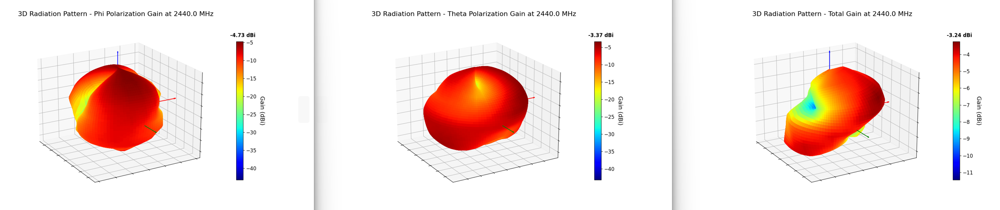

# RFlect 

**Antenna measurement visualization and analysis for RF engineers.**

[]()
[]()
[](LICENSE)
[]()

RFlect processes antenna measurement data from the Howland 3100 Antenna Chamber (WTL format), Copper Mountain VNA exports, and CST far-field simulation files. It computes TRP, passive gain, polarization parameters, and efficiency metrics with IEEE-standard methods, then generates publication-ready 2D/3D radiation pattern plots.

## Quick Start

**Windows Installer:** Download `RFlect_vX.X.X.exe` from the [latest release](https://github.com/RFingAdam/RFlect/releases).

**From source:**
```bash
git clone https://github.com/RFingAdam/RFlect.git
cd RFlect
python -m venv .venv && source .venv/bin/activate  # or .venv\Scripts\activate on Windows
pip install -r requirements.txt
python run_rflect.py
```

## Supported Data Types

| Scan Type | Input Format | Analysis |
|-----------|-------------|----------|
| **Active TRP** | WTL `.txt` (V5.02/V5.03) | TRP, H/V power, 2D/3D radiation patterns |
| **Passive Gain** | WTL HPOL + VPOL `.txt` pairs | Total/H/V gain, efficiency, directivity |
| **S-Parameters** | Copper Mountain `.csv` | S11, VSWR, return loss with limit lines |
| **Group Delay** | 2-port VNA `.csv` | Group delay vs frequency, peak-to-peak, distance error |
| **CST Far-Field** | `.txt` simulation files | ECC, fidelity factor, group delay |

## Usage

1. **Select scan type** (Active, Passive, or VNA)
2. **Adjust settings** if needed (cable loss, limit lines, frequency range)
3. **Import file(s)** via the Import button or `Ctrl+O`
4. **View results** -- plots render automatically; use `Ctrl+R` to reprocess


<details>
<summary><strong>Example Results (click to expand)</strong></summary>

### Passive Measurements

**G&D Comparison** -- Efficiency, gain, and directivity across multiple scans:


**HPOL/VPOL 1D** -- Efficiency and total gain vs frequency:


**2D Azimuth Cuts** -- Gain pattern for various theta angles:


**Datasheet Plots** -- Peak gain per polarization, polar cuts at key planes:


**3D Radiation Patterns** -- Phi, theta, and total gain:


### Active TRP Measurements

**2D Power Cuts:**


### VNA / S-Parameters

**S-Parameter Overlay:**


**Group Delay Analysis:**


</details>

## Key Features

- **Polarization Analysis** -- Axial ratio, tilt angle, XPD, and polarization sense (LHCP/RHCP) from HPOL/VPOL data with interactive and batch export modes
- **Batch Processing** -- Automatically find and process all HPOL/VPOL pairs or TRP files in a directory with organized per-pair output folders
- **Report Generation** -- Export DOCX reports with embedded plots, measurement summaries, and optional AI-generated analysis
- **3D Plot Enhancements** -- Turbo colormap, transparent panes, coordinate axes on top, manual or auto Z-axis scaling
- **Keyboard Shortcuts** -- `Ctrl+O` Import, `Ctrl+R`/`F5` Process, `Ctrl+Q` Exit

## AI Features (Optional)

RFlect integrates with OpenAI, Anthropic, and Ollama for intelligent measurement analysis. AI features include a chat assistant with function-calling tools, AI-powered report generation, and vision-based plot analysis. All AI features are optional -- RFlect works fully without any provider configured.

API keys are stored securely using OS keyring (primary) or Fernet-encrypted files bound to your machine ID. Configure via **Tools > Manage API Keys**.

See [AI_STATUS.md](AI_STATUS.md) for provider details, supported models, and roadmap.

## MCP Server

RFlect includes an MCP (Model Context Protocol) server with 20 tools for programmatic antenna analysis via AI assistants like Claude Code. Import measurements, run analysis, and generate reports without the GUI.

See [rflect-mcp/README.md](rflect-mcp/README.md) for setup and tool documentation.

## Project Structure

```
RFlect/
  plot_antenna/           # Core application
    gui/                  #   GUI mixins (callbacks, tools, dialogs, AI chat)
    ai_analysis.py        #   RF analysis engine (gain stats, pattern, polarization)
    calculations.py       #   TRP, passive gain, efficiency computations
    file_utils.py         #   WTL/VNA file parsers
    plotting.py           #   2D/3D matplotlib rendering
    llm_provider.py       #   Multi-provider LLM abstraction
    api_keys.py           #   Secure key storage (keyring + Fernet)
    save.py               #   DOCX report generation
  rflect-mcp/             # MCP server for programmatic access
  tests/                  # 227 tests (pytest)
  assets/                 # Screenshots and logo
```

## Development

```bash
pip install -r requirements-dev.txt
python -m pytest tests/                    # run tests
pyinstaller RFlect.spec                    # build exe
```

See [CONTRIBUTING.md](CONTRIBUTING.md) for coding standards, architecture details, and test guidelines.

## License

[GPL-3.0](LICENSE)
