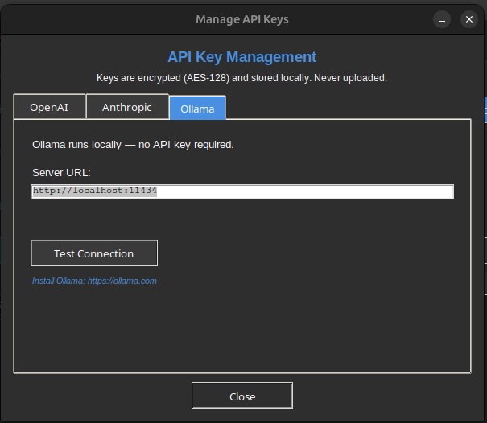

# AI Providers

RFlect supports three providers through a unified abstraction. Pick one (or none — AI is optional).

{ .rflect-screenshot }

## OpenAI

- Default provider
- Tool calling via Chat Completions (GPT-4 family) and Responses API (GPT-5 family)
- Vision via GPT-4o+

**Configure** — Tools → Manage API Keys → OpenAI tab, paste your key.
Or: `export OPENAI_API_KEY=sk-...`

Models supported: `gpt-4o-mini` (default), `gpt-4o`, `gpt-5-nano`, `gpt-5-mini`, `gpt-5.2`.

## Anthropic

- Claude Messages API
- Tool calling and vision on all Claude models

**Configure** — Tools → Manage API Keys → Anthropic tab, paste your key.
Or: `export ANTHROPIC_API_KEY=sk-ant-...`

Models supported: Claude Sonnet (4.x family), Claude Opus.

## Ollama

- Local, no API key required
- Tool calling support depends on the model (llama3.1+, qwen2.5+ work well)
- Vision via llava, llama3.2-vision, gemma3

**Configure** — make sure `ollama serve` is running. No key entry needed. RFlect auto-detects the local endpoint.

## Key storage

All keys are encrypted at rest:

- **Fernet AES-128** with PBKDF2-HMAC-SHA256 (600 K iterations)
- Salt from the machine-ID (`/etc/machine-id` on Linux, `IOPlatformUUID` on macOS, `MachineGuid` on Windows)
- Restrictive file permissions (chmod 600 / Windows ACL)

Storage priority (highest first):

1. OS keyring (Windows Credential Manager / macOS Keychain / Linux Secret Service)
2. Fernet-encrypted file in user config dir
3. Environment variable
4. `.env` file

Keys stay in an in-process `_key_cache` dict — never written to `os.environ`.

## Switching providers

Tools → AI Settings → pick provider. Affects both the AI Chat Assistant and report generation.

## See also

- [AI Status](status.md) — model support details, known limitations
- `plot_antenna/llm_provider.py` — implementation
- `plot_antenna/api_keys.py` — encryption + storage
