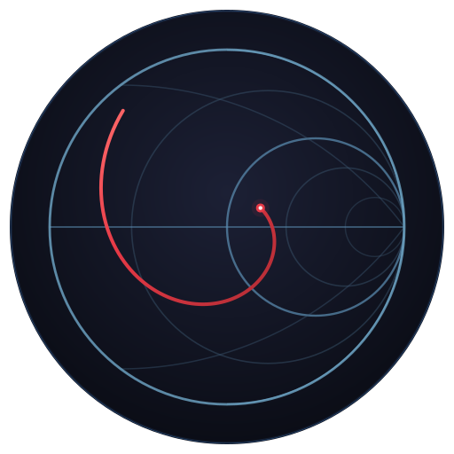
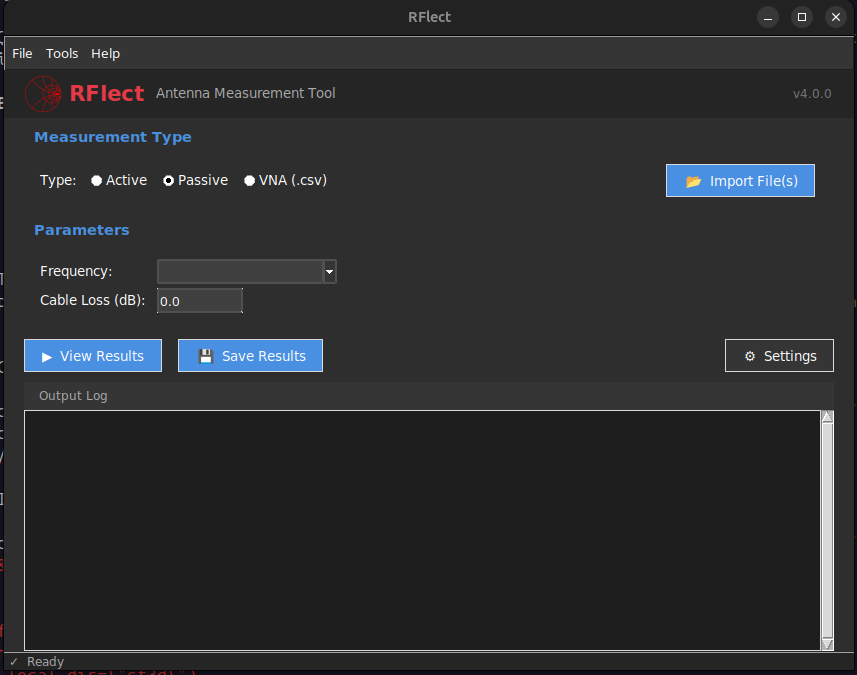
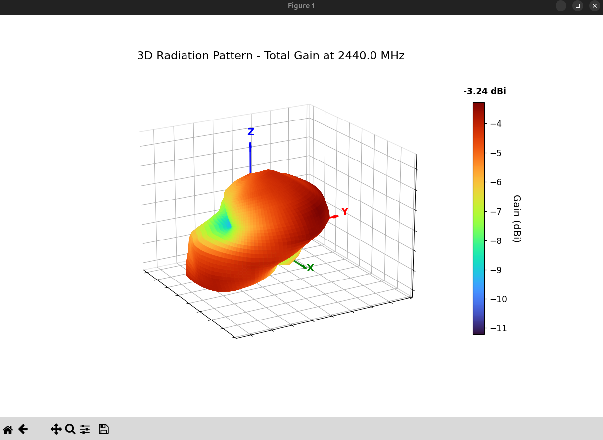
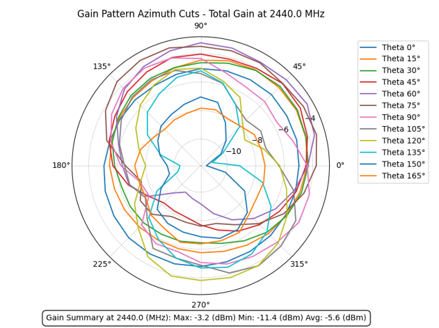
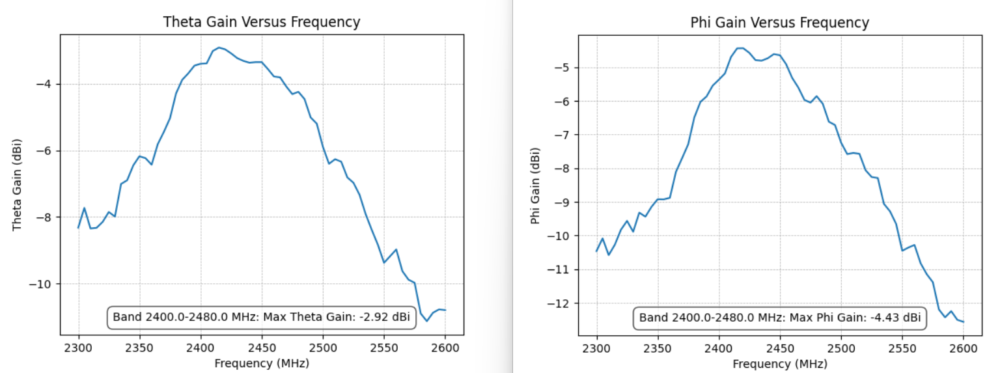
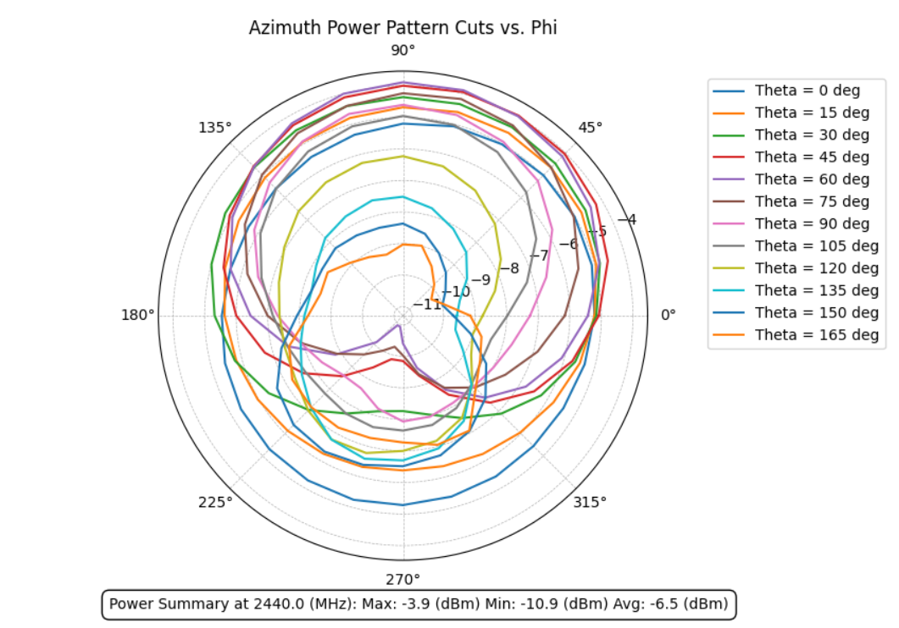
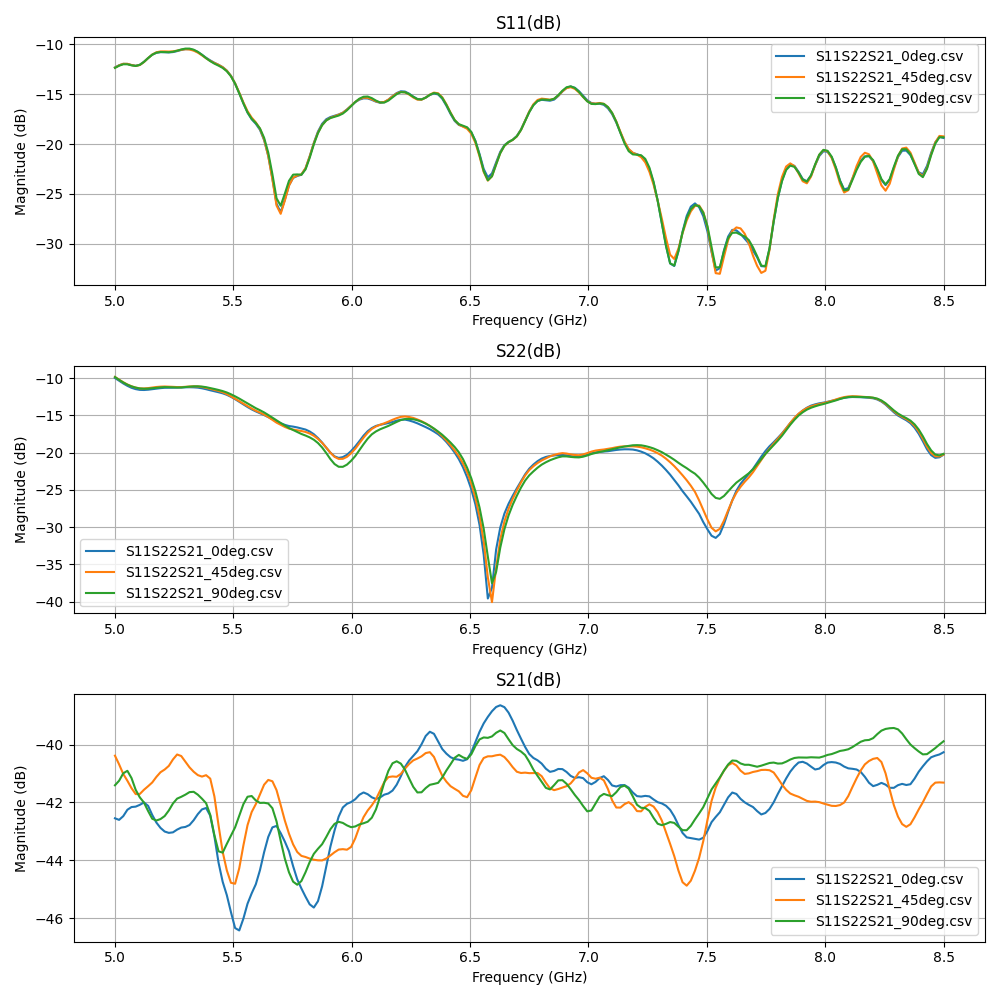
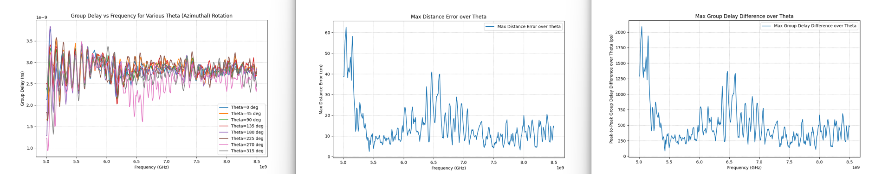

<div class="rflect-hero" markdown>
  
  <div class="rflect-hero-text" markdown>
# RFlect
**The RF engineer's toolkit for antenna measurement visualization and analysis.**
  </div>
</div>

RFlect turns raw antenna-chamber and VNA output into publication-ready 2D/3D radiation pattern plots, TRP calculations, polarization analysis, UWB characterization, and DOCX reports — all validated against IEEE-standard methods.

Whether you're characterizing a BLE chip antenna, qualifying a cellular array, or tracking calibration drift across multiple chamber sessions, RFlect handles the heavy lifting.

{ .rflect-screenshot }

## What you get

<div class="rflect-card-grid" markdown>

<a class="rflect-card" href="getting-started/quickstart/">
<strong>Quickstart →</strong>
<span>Install, import a measurement, render your first plot in under five minutes.</span>
</a>

<a class="rflect-card" href="user-guide/passive-gain/">
<strong>User Guide →</strong>
<span>Active TRP, passive gain, S11, group delay, UWB, polarization, maritime — all the math.</span>
</a>

<a class="rflect-card" href="mcp/overview/">
<strong>MCP Server →</strong>
<span>34 tools that let Claude Code &amp; Cline drive RFlect programmatically.</span>
</a>

<a class="rflect-card" href="mcp/recipes/">
<strong>Standard Procedures →</strong>
<span>One call: <code>process_folder(...)</code>. Passive / active / cal-drift / UWB / auto.</span>
</a>

<a class="rflect-card" href="ai/overview/">
<strong>AI Features →</strong>
<span>OpenAI, Anthropic, Ollama. Chat over your data. AI-augmented DOCX reports.</span>
</a>

<a class="rflect-card" href="hardware/file-formats/">
<strong>Hardware &amp; Formats →</strong>
<span>WTL chambers, Touchstone .s2p, S2VNA CSV, CST — the full input/output matrix.</span>
</a>

</div>

## Built for the way RF labs actually work

- **GUI** — desktop app (Tk-based, dark theme) for interactive review
- **MCP server** — 34 tools that let Claude Code, Cline, and other AI clients drive RFlect programmatically
- **AI-assisted reports** — DOCX with embedded plots, gain tables, and optional LLM-generated executive summaries (OpenAI / Anthropic / Ollama)
- **Cal-drift tracker** — record TRP-Cal runs over time, compare across epochs, flag setup-group mismatches

## Inputs at a glance

| What you have                                        | What RFlect produces                                                   |
|------------------------------------------------------|------------------------------------------------------------------------|
| WTL chamber `.txt` (active TRP)                      | TRP, H/V power split, 2D/3D radiation patterns                         |
| WTL chamber HPOL + VPOL `.txt` pair (passive)        | Total/H/V gain, efficiency, directivity, polarization metrics          |
| Copper Mountain / generic VNA `.csv`                 | S11, VSWR, return loss with limit lines, impedance bandwidth           |
| 2-port VNA `.csv` or Touchstone `.s2p` (group delay) | Group delay vs frequency, peak-to-peak, distance error                 |
| S2VNA `.csv` or Touchstone `.s2p` (UWB)              | SFF, transfer function, impulse response, impedance bandwidth          |
| CST simulation export                                | ECC, fidelity factor, group delay                                      |
| Folder of any of the above                           | One-call orchestration via the [`process_folder`](mcp/recipes.md) MCP tool |

## Sample outputs

=== "Passive 3D pattern"

    { .rflect-screenshot }

=== "Passive 2D cuts"

    { .rflect-screenshot }

=== "Datasheet view"

    { .rflect-screenshot }

=== "Active 2D"

    { .rflect-screenshot }

=== "VNA / S-parameters"

    { .rflect-screenshot }

=== "Group delay"

    { .rflect-screenshot }

## Drive it from Claude

```python
process_folder("/path/to/lab/captures")                     # auto-detect
process_folder("/path/to/wifi_antenna", intent="passive", report=True)
process_folder("/path/to/trp_runs",     intent="active",  report=True)
process_folder("/path/to/cal_archive",  intent="cal_drift")
process_folder("/path/to/uwb_sweep",    intent="uwb")
```

See [MCP Recipes](mcp/recipes.md) for the full set of standard procedures.

## License

[GPL-3.0](https://github.com/RFingAdam/RFlect/blob/main/LICENSE)
