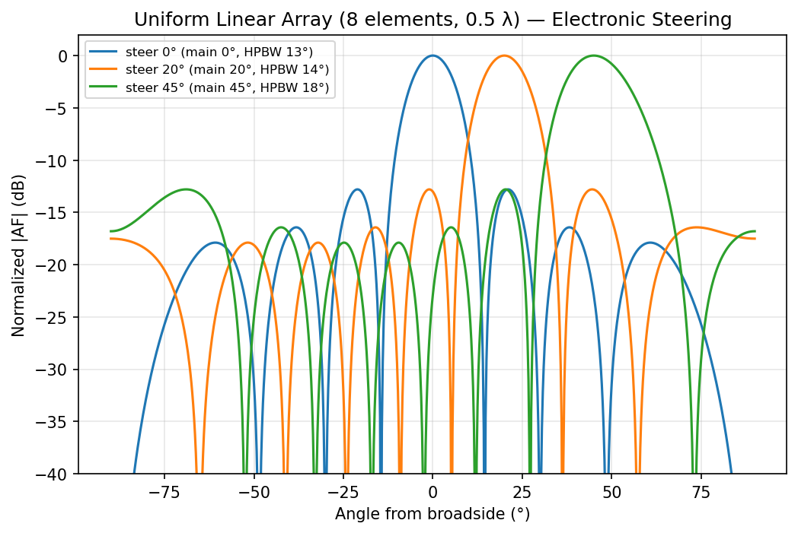
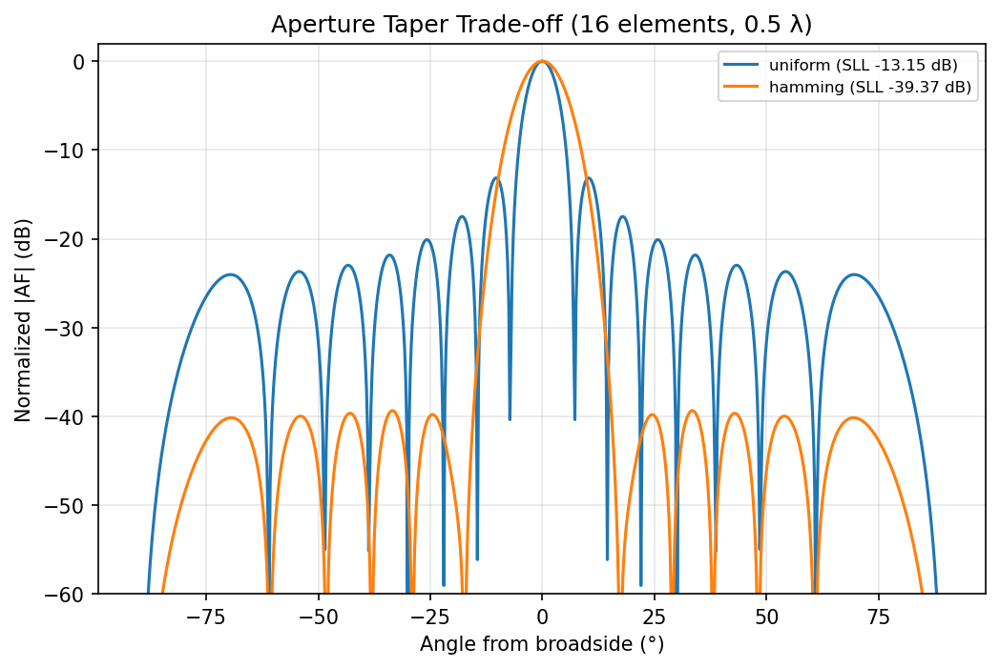
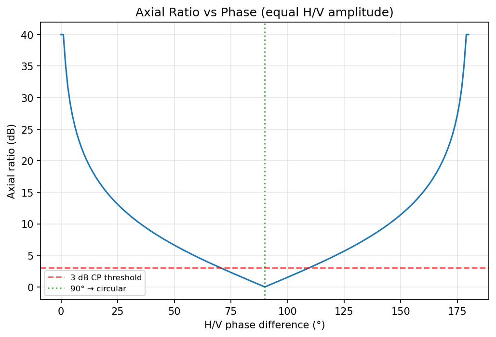

# Advanced RF Analysis

Five analysis modules added in v4.1.5 that go beyond chamber-only metrics.

## Link Budget / Range Estimation

Friis transmission with protocol presets (BLE, WiFi, LoRa, Zigbee, LTE, NB-IoT). Computes maximum range given TX power, antenna gains, frequency, and required SNR.

$$P_r = P_t + G_t + G_r - 20\log_{10}\!\left(\frac{4\pi d}{\lambda}\right) - L_{\text{cable}}$$

## Indoor Propagation

Implements **ITU-R P.1238** (distance-power loss with floor-penetration factor) and **ITU-R P.2040** (material penetration loss).

Environment presets: Office, Hospital, Industrial, Residential, etc. Each preset preloads the appropriate path-loss exponent.

## Multipath Fading

Rayleigh and Rician CDF curves plus Monte-Carlo simulation. Useful for estimating margin in cluttered environments.

## Enhanced MIMO

- **Capacity curves** — Shannon capacity vs SNR with correlation effects
- **Combining gain** — selection, equal-gain, maximal-ratio (verified math; see [Math fixes](#math-fixes-v400))
- **MEG** — Mean Effective Gain with XPR (cross-polarization power ratio)

## Wearable / Medical

Body-worn pattern adjustments. Dense-device SINR. SAR screening estimator.

## Math fixes (v4.0.0)

The original combining-gain formula was wrong. v4.0.0 verified:

- **Diversity gain** uses the Vaughan-Andersen formula $DG = 10\sqrt{1-\text{ECC}^2}$ — NOT a log-based formula.
- **Combining gain** validated against simulated MIMO-EVK data; agrees to within float precision (one pre-existing test still rounds `4.999…` vs `5.0` — unrelated to physics).

## Kraus efficiency caveat

Kraus formula:

$$\eta_{\text{Kraus}} = \frac{32400}{\text{HPBW}_E \cdot \text{HPBW}_H}$$

Only valid when both HPBW values ≤ 180°. RFlect rejects results that produce $\eta > 100\%$ — the assumption breaks for omnidirectional or low-directivity antennas.

## Accessing these modules

Tools menu → Advanced RF Analysis. Sub-dialogs are scrollable since the parameter set is large.

There are currently no MCP wrappers for these modules. Open an issue if you need one — most are pure-Python in `plot_antenna/advanced_*` and could be wrapped quickly.

## RF method gallery (v6.0)

The figures below are authentic outputs of the new v6.0 RF methods
(`plot_antenna/rf_methods.py`, exposed as MCP tools). Regenerate them with
`python docs/generate_example_figures.py`.

### Uniform linear array — electronic beam steering

An 8-element, 0.5 λ array steered to 0°, 20°, and 45°. Note the main beam
broadening (scan loss) as it steers off broadside — the reported HPBW grows from
~13° to ~18°.

### Aperture taper trade-off

Uniform vs Hamming taper on a 16-element array: the taper trades ~3 dB of main-beam
width for a large drop in peak sidelobe level.

### Axial ratio vs H/V phase

With equal H/V amplitude, axial ratio dips to 0 dB (perfect circular polarization)
at a 90° phase difference and rises toward the linear-polarization asymptote at 0°
and 180°. The 3 dB line marks the usual CP acceptance threshold.
