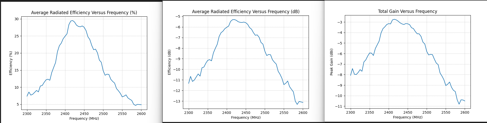

# Passive Gain

Gain, efficiency, directivity, and polarization analysis from HPOL + VPOL chamber pairs.

{ .rflect-screenshot }

## What you need

- A WTL HPOL `.txt` file (`*_HPol.txt`)
- The matching VPOL `.txt` file (`*_VPol.txt`)
- Optional: cable loss in dB

## In the GUI

1. Scan type: **Passive**
2. Set `Cable Loss (dB)` if applicable
3. `Ctrl+O` and pick the HPOL file — RFlect locates the matching VPOL automatically
4. Plots render: 1D gain/efficiency vs frequency, 2D azimuth/elevation, 3D pattern, optional datasheet plots

## What you get

| Metric                          | Notes                                                  |
|---------------------------------|--------------------------------------------------------|
| Total gain (dBi)                | $10\log_{10}(|E_\theta|^2 + |E_\phi|^2)$                |
| H-gain / V-gain                 | Ludwig-3: HPOL → $E_\phi$, VPOL → $E_\theta$            |
| Efficiency                      | Spherical sin-weighted average gain                    |
| Directivity                     | Peak gain − average gain                               |
| Axial Ratio / Tilt Angle / XPD  | Polarization-ellipse metrics (see [Polarization](polarization.md)) |
| Sense (RHCP/LHCP)               | From phase-difference $\delta$ between $E_\theta$, $E_\phi$ |

## 2D azimuth cuts

{ .rflect-screenshot }

## 1D efficiency vs frequency

{ .rflect-screenshot }

## Datasheet output

{ .rflect-screenshot }

## Math conventions

- **Ludwig-3 polarization** — HPOL is $E_\phi$ (azimuthal), VPOL is $E_\theta$ (elevation). See `plot_antenna/calculations.py:637`.
- **dB averaging** — convert to linear first: $10\log_{10}(\text{mean}(10^{dB/10}))$, then back. Never average dB directly.
- **Spherical average** — sin-weighted to account for the smaller solid angle near the poles.

## Batch / MCP

Process every HPOL/VPOL pair in a folder:

```python
process_folder("/path/to/wifi_antenna", intent="passive", report=True)
# or restrict to specific frequencies:
process_folder("/path/to/wifi_antenna", intent="passive",
               freqs=[2400, 2450, 2500], report=True)
```

See [Recipes](../mcp/recipes.md#standard-passive-procedure).

## CST export

Combine HPOL + VPOL + VSWR into a single CST Farfield Source file:

```python
convert_to_cst(hpol_path, vpol_path, vswr_path, frequency=2450)
```

## Common gotchas

- **HPOL/VPOL filenames must match.** RFlect pairs them by prefix and the `_HPol` / `_VPol` suffix. `validate_file_pair` checks angle/freq alignment.
- **Cable loss is the same for both files.** If H and V used different cables, you'll need to pre-correct the files.
- **Efficiency vs gain** — efficiency is the spherical-average; peak gain is much higher than average gain for directive antennas.

## See also

- [Concepts → Polarization](../getting-started/concepts.md#polarization)
- [Polarization analysis](polarization.md)
